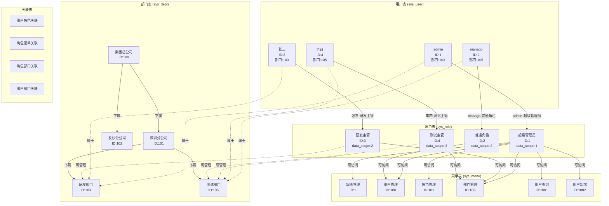
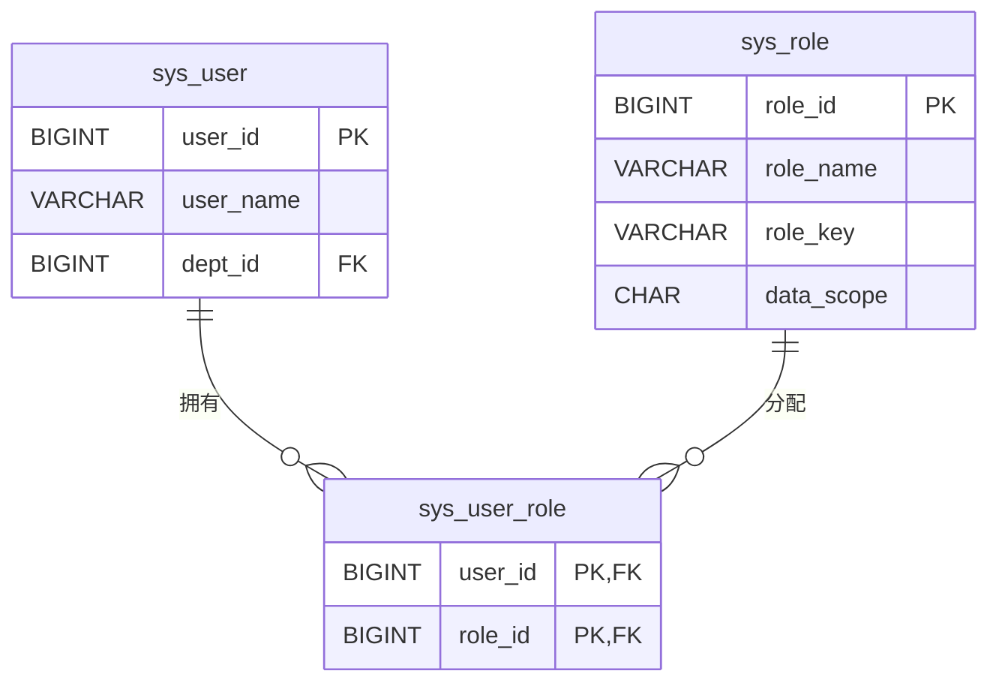
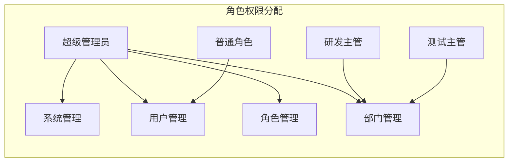
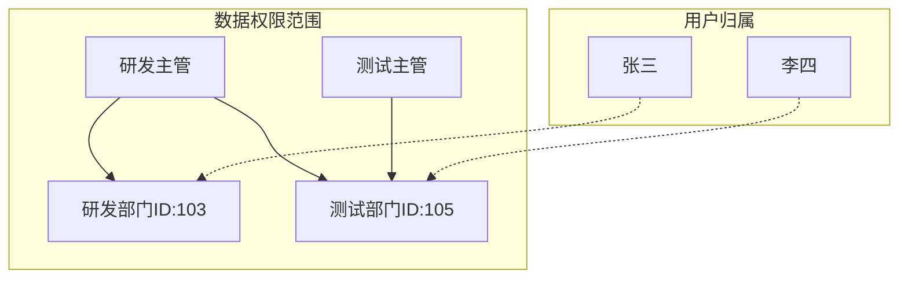
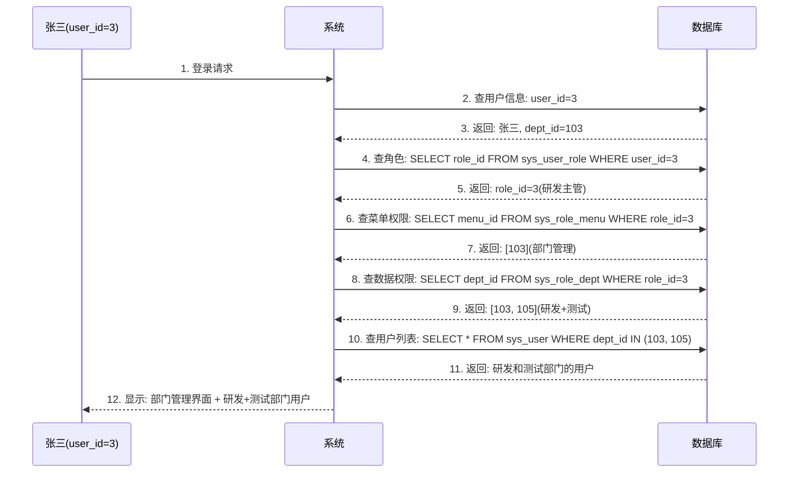

# RBAC权限系统可视化关系图

## 🎭 具体示例关系展示

基于年糕科技公司的实际数据，展示用户、角色、部门、菜单之间的关系。

## 📊 完整关系图谱



## 🔍 具体关系详解

### 1. 用户-角色关系 (sys_user_role)



**实际数据：**
```
用户ID  用户名    角色ID  角色名      数据权限范围
1       admin     1      超级管理员   全部数据 (data_scope=1)
2       nianago   2      普通角色     自定义权限 (data_scope=2)
3       张三      3      研发主管     自定义权限 (data_scope=2)
4       李四      4      测试主管     本部门权限 (data_scope=3)
```

### 2. 角色-菜单关系 (sys_role_menu)



**实际数据：**
```
角色ID  角色名      可访问菜单ID  菜单名      权限标识
1       超级管理员   1           系统管理    -
1       超级管理员   100         用户管理    system:user:list
1       超级管理员   101         角色管理    system:role:list
1       超级管理员   103         部门管理    system:dept:list
2       普通角色     100         用户管理    system:user:list
3       研发主管     103         部门管理    system:dept:list
4       测试主管     103         部门管理    system:dept:list
```

### 3. 角色-部门数据权限 (sys_role_dept)



**实际数据：**
```
角色ID  角色名      可管理部门ID  部门名
3       研发主管     103         研发部门
3       研发主管     105         测试部门
4       测试主管     105         测试部门
```

## 🎭 权限验证流程实例

### 场景：张三登录系统



## 📊 权限对比表

| 用户   | 角色     | 可访问菜单 | 可查看部门数据 | 实际效果 |
|--------|----------|------------|----------------|----------|
| admin  | 超级管理员 | 所有菜单    | 所有部门       | 全系统管理权限 |
| nianago| 普通角色   | 用户管理    | 所有部门       | 只能查看用户列表 |
| 张三   | 研发主管   | 部门管理    | 研发+测试      | 管理研发测试部门 |
| 李四   | 测试主管   | 部门管理    | 测试部门       | 只管理测试部门 |

## 🔐 具体权限检查示例

### 示例1：检查用户是否有权限访问菜单

```sql
-- 张三(user_id=3)访问部门管理(menu_id=103)的权限检查
SELECT COUNT(*) as has_permission
FROM sys_user_role ur
JOIN sys_role_menu rm ON ur.role_id = rm.role_id
WHERE ur.user_id = 3
  AND rm.menu_id = 103;

-- 结果：1 (有权限)
```

### 示例2：过滤用户数据权限

```sql
-- 张三查看用户列表时的数据过滤
SELECT u.user_id, u.nick_name, d.dept_name
FROM sys_user u
JOIN sys_dept d ON u.dept_id = d.dept_id
WHERE u.dept_id IN (
    SELECT dept_id
    FROM sys_role_dept
    WHERE role_id = 3  -- 张三的角色
)
AND u.del_flag = '0';

-- 结果：返回研发部门和测试部门的用户
```

## 🎯 实际业务场景

### 场景1：新增用户
```
admin登录：
✅ 有用户管理菜单权限
✅ 有用户新增按钮权限
✅ 能看到所有部门
→ 可以新增任意部门的用户

张三登录：
❌ 没有用户管理菜单权限
→ 看不到用户管理功能

李四登录：
❌ 没有用户管理菜单权限
→ 看不到用户管理功能
```

### 场景2：查看用户列表
```
admin登录：
✅ 有用户管理权限
✅ 数据权限：全部数据
→ 看到所有用户

nianago登录：
✅ 有用户管理权限
✅ 数据权限：自定义(未配置)
→ 只能看到自己部门的用户

张三登录：
❌ 没有用户管理权限
→ 看不到用户列表

李四登录：
❌ 没有用户管理权限
→ 看不到用户列表
```

### 场景3：管理部门信息
```
张三登录：
✅ 有部门管理权限
✅ 数据权限：研发+测试部门
→ 可以管理研发和测试部门信息

李四登录：
✅ 有部门管理权限
✅ 数据权限：本部门(测试)
→ 只能管理测试部门信息

nianago登录：
❌ 没有部门管理权限
→ 看不到部门管理功能
```

## 💡 设计精髓

### 1. 权限分离
- **功能权限**：通过角色-菜单关系控制
- **数据权限**：通过角色-部门关系控制

### 2. 灵活配置
- **多角色**：一个用户可以有多个角色
- **权限叠加**：多个角色的权限会叠加
- **精细控制**：可以控制到按钮级别

### 3. 组织适配
- **树形结构**：支持复杂的部门层级
- **数据隔离**：不同部门数据天然隔离
- **权限继承**：上级部门可以管理下级数据

这样的设计既保证了系统的安全性，又提供了足够的灵活性来适配各种复杂的业务场景。