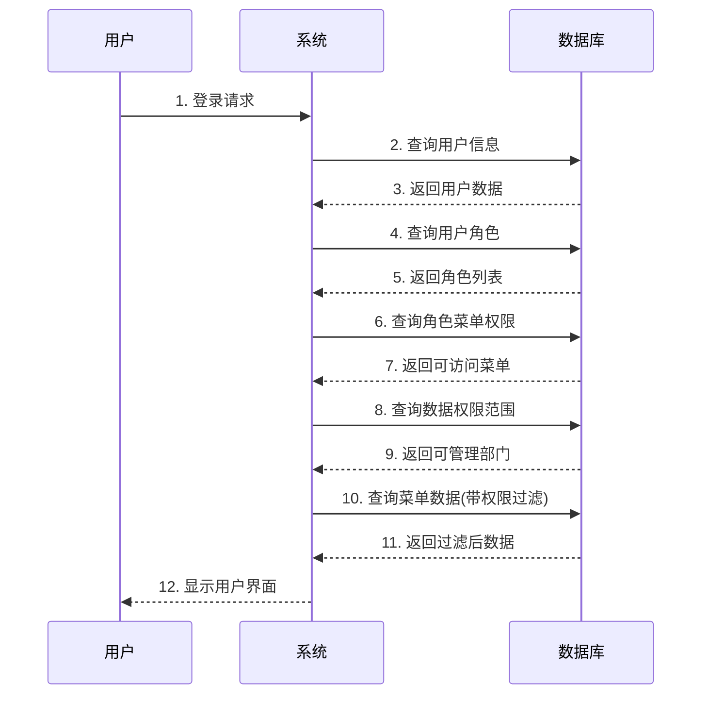

# RuoYi RBAC权限系统具体示例解析

## 🎯 用一个简单故事理解复杂关系

想象一个公司：**年糕科技公司**
- 有多个部门
- 有多个员工
- 员工有不同的角色和权限
- 系统需要控制谁能看什么、能做什么

## 📊 具体示例数据

### 1. 公司组织架构（部门表 sys_dept）

```sql
-- 部门结构
dept_id  parent_id  dept_name          位置关系
100      0         集团总公司          顶级
101      100       深圳分公司          集团总公司下属
102      100       长沙分公司          集团总公司下属
103      101       研发部门            深圳分公司下属
105      101       测试部门            深圳分公司下属
```

**层级关系图：**
```
集团总公司 (100)
├── 深圳分公司 (101)
│   ├── 研发部门 (103)
│   └── 测试部门 (105)
└── 长沙分公司 (102)
```

### 2. 员工信息（用户表 sys_user）

```sql
user_id  dept_id  user_name  nick_name     部门归属
1        103      admin      超级管理员     研发部门
2        105      niangao    年糕          测试部门
3        103      zhangsan   张三          研发部门
4        105      lisi       李四          测试部门
```

### 3. 角色定义（角色表 sys_role）

```sql
role_id  role_name    role_key     权限范围说明
1        超级管理员   admin         所有权限
2        普通角色     common        基础权限
3        研发主管     dev_manager   研发相关权限
4        测试主管     test_manager  测试相关权限
```

### 4. 系统菜单（菜单表 sys_menu）

```sql
menu_id  menu_name     parent_id  perms              类型
1        系统管理      0          -                  目录
100      用户管理      1          system:user:list    菜单
101      角色管理      1          system:role:list    菜单
103      部门管理      1          system:dept:list    菜单
1001     用户查询      100        system:user:query   按钮
1002     用户新增      100        system:user:add     按钮
1003     用户修改      100        system:user:edit    按钮
```

## 🔗 关键关联关系解析

### 关系1：用户 ↔ 角色（通过 sys_user_role）

```sql
-- 谁是什么角色？
sys_user_role:
user_id  role_id
1        1        -- admin 是 超级管理员
2        2        -- 年糕 是 普通角色
3        3        -- 张三 是 研发主管
4        4        -- 李四 是 测试主管
```

**实际意义：**
- admin(超级管理员) → 拥有全部系统权限
- 年糕(普通角色) → 只有基础查看权限
- 张三(研发主管) → 可以管理研发相关功能
- 李四(测试主管) → 可以管理测试相关功能

### 关系2：角色 ↔ 菜单（通过 sys_role_menu）

```sql
-- 角色能访问哪些菜单？
sys_role_menu:
role_id  menu_id
1        1         -- 超级管理员能访问"系统管理"
1        100       -- 超级管理员能访问"用户管理"
1        101       -- 超级管理员能访问"角色管理"
2        100       -- 普通角色能访问"用户管理"(只能看)
3        103       -- 研发主管能访问"部门管理"
4        103       -- 测试主管能访问"部门管理"
```

**实际意义：**
- **超级管理员**：可以管理所有功能
- **普通角色**：只能查看基础信息，不能管理
- **研发/测试主管**：可以管理部门信息

### 关系3：角色 ↔ 部门（通过 sys_role_dept）

```sql
-- 角色能管理哪些部门的数据？
sys_role_dept:
role_id  dept_id
3        103       -- 研发主管能管理研发部门数据
3        105       -- 研发主管能管理测试部门数据
4        105       -- 测试主管能管理测试部门数据
```

**实际意义：**
- **张三(研发主管)**：既能看研发部门数据，也能看测试部门数据
- **李四(测试主管)**：只能看测试部门数据

## 🎭 完整权限场景演示

### 场景1：admin登录系统
```
1. 用户登录：admin 用户名登录
2. 获取角色：通过 sys_user_role 查出是角色1(超级管理员)
3. 获取菜单：通过 sys_role_menu 查出能访问所有菜单
4. 获取权限：看到完整的管理界面
```

### 场景2：张三(研发主管)查看用户列表
```
1. 用户登录：zhangsan 登录
2. 获取角色：研发主管(角色3)
3. 获取菜单：只能看到被授权的菜单
4. 数据权限：只能看到研发和测试部门的用户数据
```

### 场景3：李四(测试主管)想管理用户
```
1. 用户登录：lisi 登录
2. 获取角色：测试主管(角色4)
3. 权限检查：发现没有"用户管理"权限
4. 结果：无法访问用户管理页面
```

## 📈 数据权限详解

### 数据权限等级（data_scope字段）
```sql
data_scope 值  含义              示例
1           全部数据权限        超级管理员能看到所有部门数据
2           自定义数据权限      通过 sys_role_dept 指定可管理部门
3           本部门数据权限      只能看自己部门的用户数据
4           本部门及以下数据权限  能看自己部门及下属部门数据
```

### 实际例子：张三的数据权限
```sql
-- 张三的基本信息
sys_user: user_id=3, dept_id=103(研发部门)

-- 张三的角色权限
sys_role: role_id=3, data_scope=2(自定义权限)

-- 张三能管理的部门
sys_role_dept: role_id=3, dept_id IN (103, 105)

-- 结果：张三能看研发部门(103)和测试部门(105)的用户数据
```

## 🔄 完整的权限验证流程



## 💡 实际业务举例

### 举例1：新增用户功能
```sql
-- 步骤1：检查当前用户是否有"用户新增"权限
SELECT COUNT(*) FROM sys_user_role ur
JOIN sys_role_menu rm ON ur.role_id = rm.role_id
JOIN sys_menu m ON rm.menu_id = m.menu_id
WHERE ur.user_id = 3 -- 张三
  AND m.perms = 'system:user:add';

-- 步骤2：检查数据权限
SELECT dept_id FROM sys_role_dept
WHERE role_id IN (SELECT role_id FROM sys_user_role WHERE user_id = 3);

-- 结果：张三没有用户新增权限，所以按钮是灰色的
```

### 举例2：查看用户列表
```sql
-- 张三查看用户列表时的数据过滤
SELECT * FROM sys_user
WHERE dept_id IN (
  SELECT dept_id FROM sys_role_dept
  WHERE role_id = 3  -- 张三的角色
)
OR dept_id = 103;    -- 或者查看自己的部门
```

## 🎯 总结

### 核心关系链：
```
用户 → 角色 → 菜单 (功能权限)
   ↓      ↓
  部门 → 角色部门 (数据权限)
```

### 关键点：
1. **一个用户可以有多个角色**
2. **一个角色可以分配给多个用户**
3. **菜单权限控制能做什么功能**
4. **部门数据权限控制能看什么数据**
5. **所有关系都是多对多的，通过中间表关联**

这样设计的好处是：
- 🔒 **权限灵活**：可以精确控制到按钮级别
- 👥 **组织适配**：支持复杂的组织架构
- 🚀 **扩展性强**：容易添加新的角色和权限
- 🛡️ **安全性高**：多层权限验证机制