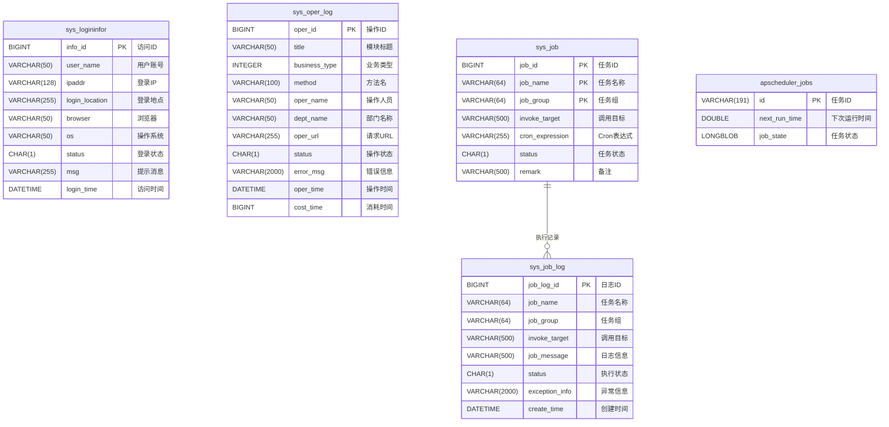

# RuoYi-Vue3-FastAPI 数据库表架构关系图

## 概述

RuoYi-Vue3-FastAPI 项目包含 **20个数据表**，采用模块化设计，支持用户权限管理、系统配置、日志监控、通知公告、定时任务和代码生成等功能。

## 表关系总览

### 1. 整体系统ER图


### 2. 用户权限管理模块ER图（详细版）


### 3. 字典管理模块ER图


### 4. 代码生成模块ER图


### 5. 系统监控模块ER图



### 6. 模块关系图（系统架构视图）


### 7. 数据流图


### 8. 表关系分类图谱


### 9. 核心业务关系图


### 10. 完整关系矩阵表

| 表名 | 关联类型 | 关联表 | 关联字段 | 说明 |
|------|----------|--------|----------|------|
| **sys_user** | 一对多 | sys_user_role | user_id | 用户角色关联 |
| sys_user | 一对多 | sys_user_post | user_id | 用户岗位关联 |
| sys_user | 多对一 | sys_dept | dept_id | 用户归属部门 |
| **sys_role** | 一对多 | sys_user_role | role_id | 角色用户关联 |
| sys_role | 一对多 | sys_role_menu | role_id | 角色菜单关联 |
| sys_role | 一对多 | sys_role_dept | role_id | 角色部门关联 |
| **sys_menu** | 一对多 | sys_role_menu | menu_id | 菜单角色关联 |
| sys_menu | 自关联 | sys_menu | parent_id | 父子菜单关系 |
| **sys_dept** | 一对多 | sys_role_dept | dept_id | 部门角色关联 |
| sys_dept | 一对多 | sys_user | dept_id | 部门用户关系 |
| sys_dept | 自关联 | sys_dept | parent_id | 父子部门关系 |
| **sys_post** | 一对多 | sys_user_post | post_id | 岗位用户关联 |
| **sys_dict_type** | 一对多 | sys_dict_data | dict_type | 字典类型数据 |
| **sys_job** | 一对多 | sys_job_log | job_name/job_group | 任务执行日志 |
| **gen_table** | 一对多 | gen_table_column | table_id | 表字段信息 |

## 详细表结构

### 1. 用户权限管理模块

#### 1.1 用户表 (sys_user)
```sql
CREATE TABLE sys_user (
  user_id           BIGINT PRIMARY KEY AUTO_INCREMENT,        -- 用户ID (主键)
  dept_id           BIGINT,                                   -- 部门ID (外键 -> sys_dept.dept_id)
  user_name         VARCHAR(30) NOT NULL,                     -- 用户账号 (唯一)
  nick_name         VARCHAR(30) NOT NULL,                     -- 用户昵称
  user_type         VARCHAR(2) DEFAULT '00',                  -- 用户类型
  email             VARCHAR(50) DEFAULT '',                    -- 用户邮箱
  phonenumber       VARCHAR(11) DEFAULT '',                    -- 手机号码
  sex               CHAR(1) DEFAULT '0',                      -- 用户性别 (0男 1女 2未知)
  avatar            VARCHAR(100) DEFAULT '',                   -- 头像地址
  password          VARCHAR(100) DEFAULT '',                   -- 密码 (BCrypt加密)
  status            CHAR(1) DEFAULT '0',                      -- 账号状态 (0正常 1停用)
  del_flag          CHAR(1) DEFAULT '0',                      -- 删除标志 (0存在 2删除)
  login_ip          VARCHAR(128) DEFAULT '',                   -- 最后登录IP
  login_date        DATETIME,                                  -- 最后登录时间
  pwd_update_date   DATETIME,                                  -- 密码最后更新时间
  create_by         VARCHAR(64) DEFAULT '',                    -- 创建者
  create_time       DATETIME DEFAULT CURRENT_TIMESTAMP,        -- 创建时间
  update_by         VARCHAR(64) DEFAULT '',                    -- 更新者
  update_time       DATETIME DEFAULT CURRENT_TIMESTAMP,        -- 更新时间
  remark            VARCHAR(500)                               -- 备注
);
```

#### 1.2 角色表 (sys_role)
```sql
CREATE TABLE sys_role (
  role_id           BIGINT PRIMARY KEY AUTO_INCREMENT,        -- 角色ID (主键)
  role_name         VARCHAR(30) NOT NULL,                     -- 角色名称
  role_key          VARCHAR(100) NOT NULL,                    -- 角色权限字符串 (唯一)
  role_sort         INTEGER NOT NULL,                         -- 显示顺序
  data_scope        CHAR(1) DEFAULT '1',                      -- 数据权限 (1全部 2自定义 3本部门 4本部门及以下)
  menu_check_strictly TINYINT(1) DEFAULT '1',                 -- 菜单树选择关联显示
  dept_check_strictly TINYINT(1) DEFAULT '1',                 -- 部门树选择关联显示
  status            CHAR(1) NOT NULL,                         -- 角色状态 (0正常 1停用)
  del_flag          CHAR(1) DEFAULT '0',                      -- 删除标志 (0存在 2删除)
  create_by         VARCHAR(64) DEFAULT '',                    -- 创建者
  create_time       DATETIME DEFAULT CURRENT_TIMESTAMP,        -- 创建时间
  update_by         VARCHAR(64) DEFAULT '',                    -- 更新者
  update_time       DATETIME DEFAULT CURRENT_TIMESTAMP,        -- 更新时间
  remark            VARCHAR(500)                               -- 备注
);
```

#### 1.3 菜单权限表 (sys_menu)
```sql
CREATE TABLE sys_menu (
  menu_id           BIGINT PRIMARY KEY AUTO_INCREMENT,        -- 菜单ID (主键)
  menu_name         VARCHAR(50) NOT NULL,                     -- 菜单名称
  parent_id         BIGINT DEFAULT '0',                       -- 父菜单ID (0为顶级菜单)
  order_num         INTEGER DEFAULT '0',                      -- 显示顺序
  path              VARCHAR(200) DEFAULT '',                   -- 路由地址
  component         VARCHAR(255),                              -- 组件路径
  query             VARCHAR(255),                              -- 路由参数
  route_name        VARCHAR(50) DEFAULT '',                    -- 路由名称
  is_frame          INTEGER DEFAULT '1',                      -- 是否外链 (0是 1否)
  is_cache          INTEGER DEFAULT '0',                      -- 是否缓存 (0缓存 1不缓存)
  menu_type         CHAR(1) DEFAULT '',                       -- 菜单类型 (M目录 C菜单 F按钮)
  visible           CHAR(1) DEFAULT '0',                      -- 菜单状态 (0显示 1隐藏)
  status            CHAR(1) DEFAULT '0',                      -- 菜单状态 (0正常 1停用)
  perms             VARCHAR(100),                             -- 权限标识
  icon              VARCHAR(100) DEFAULT '#',                 -- 菜单图标
  create_by         VARCHAR(64) DEFAULT '',                    -- 创建者
  create_time       DATETIME DEFAULT CURRENT_TIMESTAMP,        -- 创建时间
  update_by         VARCHAR(64) DEFAULT '',                    -- 更新者
  update_time       DATETIME DEFAULT CURRENT_TIMESTAMP,        -- 更新时间
  remark            VARCHAR(500) DEFAULT ''                    -- 备注
);
```

#### 1.4 部门表 (sys_dept)
```sql
CREATE TABLE sys_dept (
  dept_id           BIGINT PRIMARY KEY AUTO_INCREMENT,        -- 部门ID (主键)
  parent_id         BIGINT DEFAULT '0',                       -- 父部门ID (0为顶级部门)
  ancestors         VARCHAR(50) DEFAULT '',                   -- 祖级列表
  dept_name         VARCHAR(30) DEFAULT '',                   -- 部门名称
  order_num         INTEGER DEFAULT '0',                      -- 显示顺序
  leader            VARCHAR(20),                              -- 负责人
  phone             VARCHAR(11),                              -- 联系电话
  email             VARCHAR(50),                              -- 邮箱
  status            CHAR(1) DEFAULT '0',                      -- 部门状态 (0正常 1停用)
  del_flag          CHAR(1) DEFAULT '0',                      -- 删除标志 (0存在 2删除)
  create_by         VARCHAR(64) DEFAULT '',                    -- 创建者
  create_time       DATETIME DEFAULT CURRENT_TIMESTAMP,        -- 创建时间
  update_by         VARCHAR(64) DEFAULT '',                    -- 更新者
  update_time       DATETIME DEFAULT CURRENT_TIMESTAMP         -- 更新时间
);
```

#### 1.5 岗位信息表 (sys_post)
```sql
CREATE TABLE sys_post (
  post_id           BIGINT PRIMARY KEY AUTO_INCREMENT,        -- 岗位ID (主键)
  post_code         VARCHAR(64) NOT NULL,                     -- 岗位编码 (唯一)
  post_name         VARCHAR(50) NOT NULL,                     -- 岗位名称
  post_sort         INTEGER NOT NULL,                         -- 显示顺序
  status            CHAR(1) NOT NULL,                         -- 状态 (0正常 1停用)
  create_by         VARCHAR(64) DEFAULT '',                    -- 创建者
  create_time       DATETIME DEFAULT CURRENT_TIMESTAMP,        -- 创建时间
  update_by         VARCHAR(64) DEFAULT '',                    -- 更新者
  update_time       DATETIME DEFAULT CURRENT_TIMESTAMP,        -- 更新时间
  remark            VARCHAR(500)                               -- 备注
);
```

#### 1.6 关联表

##### 用户角色关联表 (sys_user_role)
```sql
CREATE TABLE sys_user_role (
  user_id           BIGINT PRIMARY KEY,                       -- 用户ID (主键 -> sys_user.user_id)
  role_id           BIGINT PRIMARY KEY                        -- 角色ID (主键 -> sys_role.role_id)
);
```

##### 用户岗位关联表 (sys_user_post)
```sql
CREATE TABLE sys_user_post (
  user_id           BIGINT PRIMARY KEY,                       -- 用户ID (主键 -> sys_user.user_id)
  post_id           BIGINT PRIMARY KEY                        -- 岗位ID (主键 -> sys_post.post_id)
);
```

##### 角色菜单关联表 (sys_role_menu)
```sql
CREATE TABLE sys_role_menu (
  role_id           BIGINT PRIMARY KEY,                       -- 角色ID (主键 -> sys_role.role_id)
  menu_id           BIGINT PRIMARY KEY                        -- 菜单ID (主键 -> sys_menu.menu_id)
);
```

##### 角色部门关联表 (sys_role_dept)
```sql
CREATE TABLE sys_role_dept (
  role_id           BIGINT PRIMARY KEY,                       -- 角色ID (主键 -> sys_role.role_id)
  dept_id           BIGINT PRIMARY KEY                        -- 部门ID (主键 -> sys_dept.dept_id)
);
```

### 2. 系统配置模块

#### 2.1 字典类型表 (sys_dict_type)
```sql
CREATE TABLE sys_dict_type (
  dict_id           BIGINT PRIMARY KEY AUTO_INCREMENT,        -- 字典主键
  dict_name         VARCHAR(100) DEFAULT '',                  -- 字典名称
  dict_type         VARCHAR(100) UNIQUE DEFAULT '',           -- 字典类型 (唯一)
  status            CHAR(1) DEFAULT '0',                      -- 状态 (0正常 1停用)
  create_by         VARCHAR(64) DEFAULT '',                    -- 创建者
  create_time       DATETIME DEFAULT CURRENT_TIMESTAMP,        -- 创建时间
  update_by         VARCHAR(64) DEFAULT '',                    -- 更新者
  update_time       DATETIME DEFAULT CURRENT_TIMESTAMP,        -- 更新时间
  remark            VARCHAR(500)                               -- 备注
);
```

#### 2.2 字典数据表 (sys_dict_data)
```sql
CREATE TABLE sys_dict_data (
  dict_code         BIGINT PRIMARY KEY AUTO_INCREMENT,        -- 字典编码 (主键)
  dict_sort         INTEGER DEFAULT '0',                      -- 字典排序
  dict_label        VARCHAR(100) DEFAULT '',                  -- 字典标签
  dict_value        VARCHAR(100) DEFAULT '',                  -- 字典键值
  dict_type         VARCHAR(100) DEFAULT '',                  -- 字典类型 (外键 -> sys_dict_type.dict_type)
  css_class         VARCHAR(100),                              -- 样式属性
  list_class        VARCHAR(100),                              -- 表格回显样式
  is_default        CHAR(1) DEFAULT 'N',                      -- 是否默认 (Y是 N否)
  status            CHAR(1) DEFAULT '0',                      -- 状态 (0正常 1停用)
  create_by         VARCHAR(64) DEFAULT '',                    -- 创建者
  create_time       DATETIME DEFAULT CURRENT_TIMESTAMP,        -- 创建时间
  update_by         VARCHAR(64) DEFAULT '',                    -- 更新者
  update_time       DATETIME DEFAULT CURRENT_TIMESTAMP,        -- 更新时间
  remark            VARCHAR(500)                               -- 备注
);
```

#### 2.3 参数配置表 (sys_config)
```sql
CREATE TABLE sys_config (
  config_id         INTEGER PRIMARY KEY AUTO_INCREMENT,       -- 参数主键
  config_name       VARCHAR(100) DEFAULT '',                  -- 参数名称
  config_key        VARCHAR(100) DEFAULT '',                  -- 参数键名 (唯一)
  config_value      VARCHAR(500) DEFAULT '',                  -- 参数键值
  config_type       CHAR(1) DEFAULT 'N',                      -- 系统内置 (Y是 N否)
  create_by         VARCHAR(64) DEFAULT '',                    -- 创建者
  create_time       DATETIME DEFAULT CURRENT_TIMESTAMP,        -- 创建时间
  update_by         VARCHAR(64) DEFAULT '',                    -- 更新者
  update_time       DATETIME DEFAULT CURRENT_TIMESTAMP,        -- 更新时间
  remark            VARCHAR(500)                               -- 备注
);
```

### 3. 日志监控模块

#### 3.1 系统访问记录表 (sys_logininfor)
```sql
CREATE TABLE sys_logininfor (
  info_id           BIGINT PRIMARY KEY AUTO_INCREMENT,        -- 访问ID (主键)
  user_name         VARCHAR(50) DEFAULT '',                   -- 用户账号
  ipaddr            VARCHAR(128) DEFAULT '',                   -- 登录IP地址
  login_location    VARCHAR(255) DEFAULT '',                   -- 登录地点
  browser           VARCHAR(50) DEFAULT '',                    -- 浏览器类型
  os                VARCHAR(50) DEFAULT '',                    -- 操作系统
  status            CHAR(1) DEFAULT '0',                      -- 登录状态 (0成功 1失败)
  msg               VARCHAR(255) DEFAULT '',                   -- 提示消息
  login_time        DATETIME DEFAULT CURRENT_TIMESTAMP,        -- 访问时间

  INDEX idx_sys_logininfor_s (status),
  INDEX idx_sys_logininfor_lt (login_time)
);
```

#### 3.2 操作日志记录表 (sys_oper_log)
```sql
CREATE TABLE sys_oper_log (
  oper_id           BIGINT PRIMARY KEY AUTO_INCREMENT,        -- 日志主键
  title             VARCHAR(50) DEFAULT '',                   -- 模块标题
  business_type     INTEGER DEFAULT '0',                      -- 业务类型 (0其它 1新增 2修改 3删除)
  method            VARCHAR(100) DEFAULT '',                  -- 方法名称
  request_method    VARCHAR(10) DEFAULT '',                   -- 请求方式
  operator_type     INTEGER DEFAULT '0',                      -- 操作类别 (0其它 1后台用户 2手机端用户)
  oper_name         VARCHAR(50) DEFAULT '',                   -- 操作人员
  dept_name         VARCHAR(50) DEFAULT '',                   -- 部门名称
  oper_url          VARCHAR(255) DEFAULT '',                  -- 请求URL
  oper_ip           VARCHAR(128) DEFAULT '',                  -- 主机地址
  oper_location     VARCHAR(255) DEFAULT '',                  -- 操作地点
  oper_param        VARCHAR(2000) DEFAULT '',                 -- 请求参数
  json_result       VARCHAR(2000) DEFAULT '',                 -- 返回参数
  status            INTEGER DEFAULT '0',                      -- 操作状态 (0正常 1异常)
  error_msg         VARCHAR(2000) DEFAULT '',                 -- 错误消息
  oper_time         DATETIME DEFAULT CURRENT_TIMESTAMP,        -- 操作时间
  cost_time         BIGINT DEFAULT '0',                       -- 消耗时间

  INDEX idx_sys_oper_log_bt (business_type),
  INDEX idx_sys_oper_log_s (status),
  INDEX idx_sys_oper_log_ot (oper_time)
);
```

### 4. 通知公告模块

#### 4.1 通知公告表 (sys_notice)
```sql
CREATE TABLE sys_notice (
  notice_id         INTEGER PRIMARY KEY AUTO_INCREMENT,       -- 公告ID (主键)
  notice_title      VARCHAR(50) NOT NULL,                     -- 公告标题
  notice_type       CHAR(1) NOT NULL,                         -- 公告类型 (1通知 2公告)
  notice_content    LONGBLOB,                                  -- 公告内容
  status            CHAR(1) DEFAULT '0',                      -- 公告状态 (0正常 1关闭)
  create_by         VARCHAR(64) DEFAULT '',                    -- 创建者
  create_time       DATETIME DEFAULT CURRENT_TIMESTAMP,        -- 创建时间
  update_by         VARCHAR(64) DEFAULT '',                    -- 更新者
  update_time       DATETIME DEFAULT CURRENT_TIMESTAMP,        -- 更新时间
  remark            VARCHAR(255)                               -- 备注
);
```

### 5. 定时任务模块

#### 5.1 定时任务调度表 (sys_job)
```sql
CREATE TABLE sys_job (
  job_id            BIGINT PRIMARY KEY AUTO_INCREMENT,        -- 任务ID (主键)
  job_name          VARCHAR(64) PRIMARY KEY DEFAULT '',       -- 任务名称 (主键)
  job_group         VARCHAR(64) PRIMARY KEY DEFAULT 'default',-- 任务组名 (主键)
  job_executor      VARCHAR(64) DEFAULT 'default',            -- 任务执行器
  invoke_target     VARCHAR(500) NOT NULL,                    -- 调用目标字符串
  job_args          VARCHAR(255) DEFAULT '',                  -- 位置参数
  job_kwargs        VARCHAR(255) DEFAULT '',                  -- 关键字参数
  cron_expression   VARCHAR(255) DEFAULT '',                  -- cron执行表达式
  misfire_policy    VARCHAR(20) DEFAULT '3',                  -- 计划执行错误策略 (1立即 2执行一次 3放弃)
  concurrent        CHAR(1) DEFAULT '1',                      -- 是否并发执行 (0允许 1禁止)
  status            CHAR(1) DEFAULT '0',                      -- 状态 (0正常 1暂停)
  create_by         VARCHAR(64) DEFAULT '',                    -- 创建者
  create_time       DATETIME DEFAULT CURRENT_TIMESTAMP,        -- 创建时间
  update_by         VARCHAR(64) DEFAULT '',                    -- 更新者
  update_time       DATETIME DEFAULT CURRENT_TIMESTAMP,        -- 更新时间
  remark            VARCHAR(500) DEFAULT ''                   -- 备注信息
);
```

#### 5.2 定时任务调度日志表 (sys_job_log)
```sql
CREATE TABLE sys_job_log (
  job_log_id        BIGINT PRIMARY KEY AUTO_INCREMENT,        -- 任务日志ID (主键)
  job_name          VARCHAR(64) NOT NULL,                     -- 任务名称
  job_group         VARCHAR(64) NOT NULL,                     -- 任务组名
  job_executor      VARCHAR(64) NOT NULL,                     -- 任务执行器
  invoke_target     VARCHAR(500) NOT NULL,                    -- 调用目标字符串
  job_args          VARCHAR(255) DEFAULT '',                  -- 位置参数
  job_kwargs        VARCHAR(255) DEFAULT '',                  -- 关键字参数
  job_trigger       VARCHAR(255) DEFAULT '',                  -- 任务触发器
  job_message       VARCHAR(500),                             -- 日志信息
  status            CHAR(1) DEFAULT '0',                      -- 执行状态 (0正常 1失败)
  exception_info    VARCHAR(2000) DEFAULT '',                 -- 异常信息
  create_time       DATETIME DEFAULT CURRENT_TIMESTAMP        -- 创建时间
);
```

#### 5.3 APScheduler任务表 (apscheduler_jobs)
```sql
CREATE TABLE apscheduler_jobs (
  id                VARCHAR(191) PRIMARY KEY,                 -- 任务ID (主键)
  next_run_time     DOUBLE,                                   -- 下次运行时间
  job_state         LONGBLOB NOT NULL,                        -- 任务状态

  INDEX ix_apscheduler_jobs_next_run_time (next_run_time)
);
```

### 6. 代码生成模块

#### 6.1 代码生成业务表 (gen_table)
```sql
CREATE TABLE gen_table (
  table_id          BIGINT PRIMARY KEY AUTO_INCREMENT,        -- 编号 (主键)
  table_name        VARCHAR(200) DEFAULT '',                  -- 表名称
  table_comment     VARCHAR(500) DEFAULT '',                  -- 表描述
  sub_table_name    VARCHAR(64),                              -- 关联子表的表名
  sub_table_fk_name VARCHAR(64),                              -- 子表关联的外键名
  class_name        VARCHAR(100) DEFAULT '',                  -- 实体类名称
  tpl_category      VARCHAR(200) DEFAULT 'crud',              -- 使用模板 (crud tree)
  tpl_web_type      VARCHAR(30) DEFAULT '',                   -- 前端模板类型
  package_name      VARCHAR(100),                             -- 生成包路径
  module_name       VARCHAR(30),                              -- 生成模块名
  business_name     VARCHAR(30),                              -- 生成业务名
  function_name     VARCHAR(50),                              -- 生成功能名
  function_author   VARCHAR(50),                              -- 生成功能作者
  gen_type          CHAR(1) DEFAULT '0',                      -- 生成代码方式 (0zip 1自定义路径)
  gen_path          VARCHAR(200) DEFAULT '/',                 -- 生成路径
  options           VARCHAR(1000),                            -- 其它生成选项
  create_by         VARCHAR(64) DEFAULT '',                    -- 创建者
  create_time       DATETIME DEFAULT CURRENT_TIMESTAMP,        -- 创建时间
  update_by         VARCHAR(64) DEFAULT '',                    -- 更新者
  update_time       DATETIME DEFAULT CURRENT_TIMESTAMP,        -- 更新时间
  remark            VARCHAR(500)                               -- 备注
);
```

#### 6.2 代码生成业务表字段 (gen_table_column)
```sql
CREATE TABLE gen_table_column (
  column_id         BIGINT PRIMARY KEY AUTO_INCREMENT,        -- 编号 (主键)
  table_id          BIGINT,                                   -- 归属表编号 (外键 -> gen_table.table_id)
  column_name       VARCHAR(200),                             -- 列名称
  column_comment    VARCHAR(500),                             -- 列描述
  column_type       VARCHAR(100),                             -- 列类型
  python_type       VARCHAR(500),                             -- PYTHON类型
  python_field      VARCHAR(200),                             -- PYTHON字段名
  is_pk             CHAR(1),                                  -- 是否主键 (1是)
  is_increment      CHAR(1),                                  -- 是否自增 (1是)
  is_required       CHAR(1),                                  -- 是否必填 (1是)
  is_unique         CHAR(1),                                  -- 是否唯一 (1是)
  is_insert         CHAR(1),                                  -- 是否插入字段 (1是)
  is_edit           CHAR(1),                                  -- 是否编辑字段 (1是)
  is_list           CHAR(1),                                  -- 是否列表字段 (1是)
  is_query          CHAR(1),                                  -- 是否查询字段 (1是)
  query_type        VARCHAR(200) DEFAULT 'EQ',                -- 查询方式
  html_type         VARCHAR(200),                             -- 显示类型
  dict_type         VARCHAR(200) DEFAULT '',                  -- 字典类型
  sort              INTEGER,                                  -- 排序
  create_by         VARCHAR(64) DEFAULT '',                    -- 创建者
  create_time       DATETIME DEFAULT CURRENT_TIMESTAMP,        -- 创建时间
  update_by         VARCHAR(64) DEFAULT '',                    -- 更新者
  update_time       DATETIME DEFAULT CURRENT_TIMESTAMP,        -- 更新时间
  FOREIGN KEY (table_id) REFERENCES gen_table(table_id)        -- 外键约束
);
```

## 表关系详解

### 1. 用户权限管理关系

**核心关系链：**
```
sys_user ←→ sys_user_role ←→ sys_role ←→ sys_role_menu ←→ sys_menu
    ↓           ↓              ↓              ↓
sys_dept  sys_user_post   sys_post    sys_role_dept ←→ sys_dept
```

**详细说明：**
- **用户-角色多对多**: `sys_user` 与 `sys_role` 通过 `sys_user_role` 关联
- **角色-菜单多对多**: `sys_role` 与 `sys_menu` 通过 `sys_role_menu` 关联
- **角色-部门多对多**: `sys_role` 与 `sys_dept` 通过 `sys_role_dept` 关联
- **用户-岗位多对多**: `sys_user` 与 `sys_post` 通过 `sys_user_post` 关联
- **用户-部门一对多**: `sys_user.dept_id` 关联 `sys_dept.dept_id`

### 2. 字典管理关系

**关系链：**
```
sys_dict_type ←→ sys_dict_data
```

**业务关联：**
- `sys_user.status` → `sys_dict_data` (user_status)
- `sys_role.status` → `sys_dict_data` (sys_normal_disable)
- `sys_menu.menu_type` → `sys_dict_data` (sys_menu_type)
- `sys_dept.status` → `sys_dict_data` (sys_normal_disable)
- `sys_post.status` → `sys_dict_data` (sys_normal_disable)
- `sys_notice.notice_type` → `sys_dict_data` (sys_notice_type)
- `sys_job.status` → `sys_dict_data` (sys_job_status)

### 3. 代码生成关系

**关系链：**
```
gen_table ←→ gen_table_column
```

**外键关系：**
- `gen_table_column.table_id` → `gen_table.table_id` (一对多)
- SQLAlchemy ORM 关系：`GenTable.columns` ↔ `GenTableColumn.tables`

### 4. 数据权限关系

**数据权限控制流程：**
1. 用户登录获取用户ID
2. 通过 `sys_user_role` 获取用户角色
3. 通过 `sys_role_dept` 获取角色数据权限范围
4. 根据角色的 `data_scope` 字段确定数据访问范围：
   - `1`: 全部数据权限
   - `2`: 自定义数据权限
   - `3`: 本部门数据权限
   - `4`: 本部门及以下数据权限

### 5. 菜单权限关系

**菜单权限控制流程：**
1. 用户登录获取用户ID
2. 通过 `sys_user_role` 获取用户角色
3. 通过 `sys_role_menu` 获取角色菜单权限
4. 根据 `sys_menu` 表生成用户可访问的菜单树

## 索引设计

### 主要索引

**性能优化索引：**
- `sys_logininfor`:
  - `idx_sys_logininfor_s(status)` - 状态查询
  - `idx_sys_logininfor_lt(login_time)` - 时间查询
- `sys_oper_log`:
  - `idx_sys_oper_log_bt(business_type)` - 业务类型查询
  - `idx_sys_oper_log_s(status)` - 状态查询
  - `idx_sys_oper_log_ot(oper_time)` - 时间查询
- `apscheduler_jobs`:
  - `ix_apscheduler_jobs_next_run_time(next_run_time)` - 调度时间查询

### 建议的索引优化

```sql
-- 用户表优化索引
CREATE INDEX idx_sys_user_dept_id ON sys_user(dept_id);
CREATE INDEX idx_sys_user_status ON sys_user(status);
CREATE INDEX idx_sys_user_del_flag ON sys_user(del_flag);

-- 角色表优化索引
CREATE INDEX idx_sys_role_status ON sys_role(status);
CREATE INDEX idx_sys_role_del_flag ON sys_role(del_flag);

-- 菜单表优化索引
CREATE INDEX idx_sys_menu_parent_id ON sys_menu(parent_id);
CREATE INDEX idx_sys_menu_status ON sys_menu(status);
CREATE INDEX idx_sys_menu_menu_type ON sys_menu(menu_type);

-- 部门表优化索引
CREATE INDEX idx_sys_dept_parent_id ON sys_dept(parent_id);
CREATE INDEX idx_sys_dept_status ON sys_dept(status);
CREATE INDEX idx_sys_dept_del_flag ON sys_dept(del_flag);
```

## 数据完整性约束

### 唯一性约束

```sql
-- 用户账号唯一
UNIQUE KEY uk_user_name (user_name)

-- 角色权限字符串唯一
UNIQUE KEY uk_role_key (role_key)

-- 岗位编码唯一
UNIQUE KEY uk_post_code (post_code)

-- 字典类型唯一
UNIQUE KEY uk_dict_type (dict_type)

-- 参数键名唯一
UNIQUE KEY uk_config_key (config_key)
```

### 数据一致性约束

1. **软删除一致性**: 所有核心业务表都有 `del_flag` 字段
2. **状态字段一致性**: 状态字段通常使用 `0/1` 表示正常/停用
3. **审计字段一致性**: 所有表都有 `create_by/create_time/update_by/update_time`
4. **外键逻辑一致性**: 通过代码层面保证关联数据的完整性

---

*本文档基于 RuoYi-Vue3-FastAPI 项目 v1.7.1 版本生成，完整展示了系统的表结构、关系设计和约束机制。*