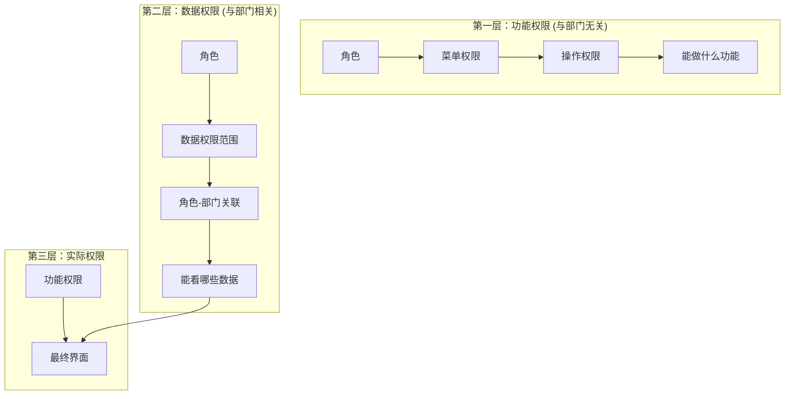
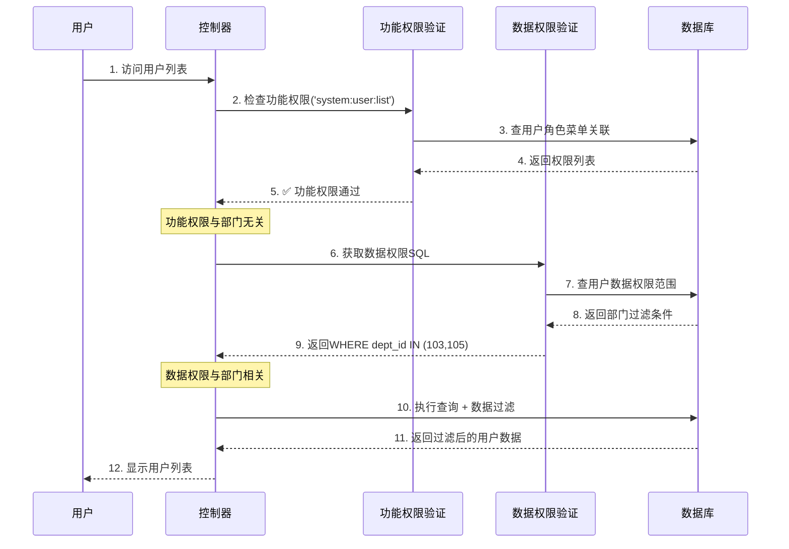

# 权限与部门关系终极解析

## 🎯 核心问题回答

**你的观察完全正确！**

**功能权限确实和部门没关系，但数据权限和部门密切相关！**

---

## 🏗️ 权限系统的三层架构



---

## 🔍 权限与部门关系详解

### 1. **功能权限 ≠ 部门相关**

**功能权限控制：** 能访问哪些功能、执行哪些操作

**与部门关系：** ❌ **完全无关**

```sql
-- 功能权限查询 - 完全不涉及部门表
SELECT m.perms
FROM sys_user_role ur
JOIN sys_role_menu rm ON ur.role_id = rm.role_id
JOIN sys_menu m ON rm.menu_id = m.menu_id
WHERE ur.user_id = ?;

-- 结果：['system:user:list', 'system:user:query', 'system:user:add']
-- 这些权限标识与部门无关，只与角色相关
```

**实际例子：**
```
👤 张三（研发主管，在研发部门）
├── ✅ 有用户管理权限 (system:user:list)
├── ✅ 有部门管理权限 (system:dept:list)
└── ❌ 没有系统监控权限

👤 李四（测试主管，在测试部门）
├── ✅ 有用户管理权限 (system:user:list)
├── ✅ 有部门管理权限 (system:dept:list)
└── ❌ 没有系统监控权限

结论：即使在不同部门，相同角色有相同的功能权限
```

### 2. **数据权限 = 部门相关**

**数据权限控制：** 能访问哪些部门的数据

**与部门关系：** ✅ **密切相关**

```sql
-- 数据权限查询 - 完全基于部门关系
SELECT dept_id
FROM sys_role_dept
WHERE role_id IN (SELECT role_id FROM sys_user_role WHERE user_id = ?);

-- 结合角色的data_scope字段确定数据范围
```

**数据权限等级：**
```python
DATA_SCOPE_ALL = '1'           # 全部数据权限（与部门无关）
DATA_SCOPE_CUSTOM = '2'        # 自定义数据权限（通过sys_role_dept指定部门）
DATA_SCOPE_DEPT = '3'          # 本部门数据权限（用户所在部门）
DATA_SCOPE_DEPT_AND_CHILD = '4' # 本部门及下属部门（部门层级关系）
DATA_SCOPE_SELF = '5'          # 仅本人数据（与部门无关，只看自己）
```

---

## 🎪 实际场景演示

### 场景：用户管理功能

#### 1. 功能权限检查（与部门无关）
```python
# 用户想访问用户列表页面
@userController.get('/list', dependencies=[Depends(CheckUserInterfaceAuth('system:user:list'))])
async def get_user_list():
    pass

# 权限检查过程：
# 1. 检查用户是否有'system:user:list'权限
# 2. 通过角色-菜单关联表检查
# 3. ❌ 不涉及部门表查询
```

#### 2. 数据权限过滤（与部门相关）
```python
# 获取用户列表时的数据过滤
async def get_user_list(..., data_scope_sql: str = Depends(GetDataScope('SysUser'))):
    # 这里会注入数据权限SQL条件
    user_page_query_result = await UserService.get_user_list_services(
        query_db, user_page_query, data_scope_sql, is_page=True
    )

# GetDataScope生成的SQL条件示例：
# 张三（研发主管，data_scope=2，自定义权限：103,105部门）
# SQL: WHERE dept_id IN (103, 105)

# 李四（测试主管，data_scope=3，本部门权限：105部门）
# SQL: WHERE dept_id = 105
```

---

## 📊 权限与部门关系的完整矩阵

| 用户 | 所属部门 | 角色 | 功能权限 | 数据权限 | 实际效果 |
|------|----------|------|----------|----------|----------|
| admin | 研发部门 | 超级管理员 | 全部功能 | 全部数据 | 能做任何操作，看任何数据 |
| 张三 | 研发部门 | 研发主管 | 部门管理+用户管理 | 研发+测试部门数据 | 能管理用户，但只能看研发测试数据 |
| 李四 | 测试部门 | 测试主管 | 部门管理+用户管理 | 仅测试部门数据 | 能管理用户，但只能看测试数据 |
| nianago | 测试部门 | 普通角色 | 仅用户查看 | 仅本部门数据 | 只能看本部门用户，不能操作 |

### 关键发现：

1. **功能权限相同：** 张三和李四都有相同的功能权限
2. **数据权限不同：** 张三能看更多部门的数据
3. **功能权限与部门无关：** 无论在哪个部门，相同角色有相同功能权限

---

## 🔍 技术实现细节

### 功能权限验证代码
```python
# interface_auth.py - 与部门无关的权限验证
class CheckUserInterfaceAuth:
    def __call__(self, current_user: CurrentUserModel):
        user_auth_list = current_user.permissions  # ['system:user:list', ...]

        if self.perm in user_auth_list:  # 检查权限标识
            return True

        # ❌ 整个过程不涉及任何部门相关查询
```

### 数据权限过滤代码
```python
# data_scope.py - 与部门相关的数据权限
class GetDataScope:
    def __call__(self, current_user: CurrentUserModel):
        dept_id = current_user.user.dept_id  # 用户所属部门

        for role in current_user.user.role:
            if role.data_scope == self.DATA_SCOPE_CUSTOM:
                # ✅ 这里涉及部门查询
                param_sql_list.append(
                    f"{self.query_alias}.{self.dept_alias}.in_("
                    f"select(SysRoleDept.dept_id).where(SysRoleDept.role_id == {role.role_id})"
                    f")"
                )
            elif role.data_scope == self.DATA_SCOPE_DEPT:
                # ✅ 这里涉及部门查询
                param_sql_list.append(f"{self.query_alias}.{self.dept_alias} == {dept_id}")
```

---

## 🎯 权限验证的完整流程



---

## 💡 核心概念区分

### 功能权限（Function Permission）
- **定义：** 能访问哪些功能模块
- **管理方式：** 角色 → 菜单关联
- **与部门关系：** ❌ 无关
- **控制级别：** 页面、按钮
- **验证方式：** `CheckUserInterfaceAuth`装饰器

### 数据权限（Data Permission）
- **定义：** 能访问哪些数据范围
- **管理方式：** 角色 → 数据权限范围 → 部门关联
- **与部门关系：** ✅ 密切相关
- **控制级别：** 数据行级别
- **验证方式：** `GetDataScope`依赖注入

---

## 🎭 实际应用示例

### 示例1：同一个功能，不同数据权限

```
张三（研发主管）和李四（测试主管）都能：
✅ 看到用户管理页面（功能权限相同）
✅ 看到新增/修改/删除按钮（功能权限相同）

但是看到的数据不同：
张三看到：研发部门用户 + 测试部门用户
李四看到：仅测试部门用户
```

### 示例2：不同角色，相同部门的数据权限

```
假设王五也在测试部门，角色是普通员工：

功能权限：
❌ 看不到用户管理页面（角色不同）
❌ 看不到部门管理页面

数据权限：
如果分配了查看权限，只能看测试部门数据
```

### 示例3：超级管理员特殊权限

```
admin在任何部门：
功能权限：全部功能（通过role_id=1获得）
数据权限：全部数据（通过'*:*:*'权限标识获得）
```

---

## 🎯 总结

### 权限与部门关系的核心结论：

1. **功能权限 ✖️ 部门**
   - 功能权限完全基于角色，与用户所在部门无关
   - 相同角色在任何部门都有相同的功能权限

2. **数据权限 ✔️ 部门**
   - 数据权限完全基于部门和角色的关联关系
   - 相同角色在不同配置下有不同的数据权限

3. **实际权限 = 功能权限 + 数据权限**
   - 功能权限决定"能做什么"
   - 数据权限决定"能看到什么"

### 设计优势：

- **🔐 安全性：** 多层权限验证
- **🎯 灵活性：** 功能和数据权限分离
- **📈 扩展性：** 支持复杂的组织架构
- **🎪 实用性：** 贴合实际业务需求

这种分离设计是现代RBAC权限系统的最佳实践！ 🚀

---

**文档位置：** `C:\work\tinker\answer\RuoYi-Vue3-FastAPI\权限与部门关系终极解析.md`