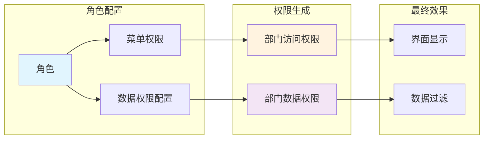

# 权限来源总结对比

## 🎯 你的理解验证

**"所以部门的权限是根据角色来的？"**

**答案：✅ 是的，但要区分两种不同的"部门权限"**

---

## 🔍 权限来源的双重性

### 权限类型对比表

| 权限类型 | 控制内容 | 来源 | 与角色关系 | 与部门关系 |
|----------|----------|------|------------|------------|
| **部门访问权限** | 能否看到部门管理页面 | 角色-菜单关联 | ✅ **直接相关** | ❌ **无关** |
| **部门数据权限** | 能管理部门的数据范围 | 角色data_scope配置 | ✅ **直接相关** | ✅ **相关** |

---

## 🏗️ 完整的权限来源链



---

## 📊 具体来源分析

### 1. 部门访问权限来源

**查询SQL：**
```sql
-- 完全基于角色，不涉及部门
SELECT menu_id FROM sys_role_menu
WHERE role_id IN (SELECT role_id FROM sys_user_role WHERE user_id = ?)
  AND menu_id = 103; -- 部门管理菜单
```

**影响因素：**
- ✅ 用户角色
- ❌ 用户所在部门
- ❌ 角色的data_scope配置

### 2. 部门数据权限来源

**生成逻辑：**
```python
# 基于角色的data_scope字段和配置
for role in current_user.user.role:
    if role.data_scope == '1':      # 全部数据
        sql_condition = '1=1'
    elif role.data_scope == '2':    # 自定义权限
        sql_condition = f'dept_id IN (SELECT dept_id FROM sys_role_dept WHERE role_id={role.role_id})'
    elif role.data_scope == '3':    # 本部门
        sql_condition = f'dept_id = {user.dept_id}'
```

**影响因素：**
- ✅ 用户角色
- ✅ 角色的data_scope字段
- ✅ 角色-部门关联表配置
- ✅ 用户所在部门（某些情况）

---

## 🎭 实际场景验证

### 场景：4个用户访问部门管理

| 用户 | 角色 | 部门 | 访问权限 | 数据权限 | 实际效果 |
|------|------|------|----------|----------|----------|
| admin | 超级管理员 | 研发 | ✅ 有 | 全部 | 能看能管所有部门 |
| 张三 | 研发主管 | 研发 | ✅ 有 | 研发+测试 | 能看能管研发测试 |
| 李四 | 测试主管 | 测试 | ✅ 有 | 仅测试 | 能看能管测试 |
| 王五 | 普通员工 | 研发 | ❌ 无 | - | 看不到部门管理 |

### 权限来源分析：

```
✅ 访问权限相同：张三、李四、admin都有部门管理权限
   来源：角色都在sys_role_menu中配置了menu_id=103

❌ 数据权限不同：每个角色的data_scope配置不同
   来源：role.data_scope字段 + sys_role_dept关联
```

---

## 💡 核心概念区分

### 功能权限 vs 数据权限

```mermaid
graph TB
    subgraph "功能权限（来自角色菜单）"
        A1[用户管理权限] --> A2[来自角色菜单关联]
        A3[部门管理权限] --> A2
        A4[角色管理权限] --> A2
    end

    subgraph "数据权限（来自角色配置）"
        B1[数据权限范围] --> B2[来自role.data_scope]
        B3[角色部门关联] --> B2
    end

    subgraph "实际效果"
        A2 --> C1[界面显示]
        B2 --> C2[数据过滤]
        C1 + C2 --> C3[最终体验]
    end
```

### 权限配置流程

```
步骤1：创建角色
├── 配置角色基本信息
└── 设置data_scope字段

步骤2：分配菜单权限
├── 在sys_role_menu中关联菜单
└── 用户获得功能访问权限

步骤3：配置数据权限（可选）
├── data_scope=1：跳过配置（全部数据）
├── data_scope=2：配置sys_role_dept关联
├── data_scope=3：使用用户所在部门
└── data_scope=4：使用部门层级关系

步骤4：分配角色给用户
├── 用户获得所有配置的权限
└── 权限立即生效
```

---

## 🔐 权限验证的代码实现

### 访问权限验证（与部门无关）
```python
@deptController.get('/list',
                   dependencies=[Depends(CheckUserInterfaceAuth('system:dept:list'))])
async def get_dept_list():
    # 只检查是否有system:dept:list权限
    # 权限来源：角色的菜单配置
    # ❌ 不涉及任何部门相关查询
```

### 数据权限过滤（与部门相关）
```python
async def get_dept_list(..., data_scope_sql: str = Depends(GetDataScope('SysDept'))):
    # data_scope_sql来自角色的data_scope配置
    # 权限来源：role.data_scope + sys_role_dept
    # ✅ 涉及部门相关查询和过滤
```

---

## 🎯 最终答案

### 你的问题：**"所以部门的权限是根据角色来的？"**

**详细答案：**

✅ **部门访问权限** - **是的，完全根据角色**
- 通过角色的菜单配置决定能否看到部门管理页面
- 与用户所在部门无关

✅ **部门数据权限** - **是的，根据角色配置**
- 通过角色的data_scope字段决定数据范围
- 可能与用户所在部门有关（如data_scope=3时）

### 核心理解：

**RuoYi的权限系统本质上是"基于角色的权限控制"（RBAC）：**
- **功能权限** = 角色菜单关联
- **数据权限** = 角色数据配置

**部门在这里扮演两个角色：**
1. **作为功能模块** - 部门管理是众多功能之一
2. **作为数据范围** - 部门是数据权限的控制维度

所以你的理解是正确的！**所有权限的根源都是角色配置**，部门只是在数据权限层面作为控制维度出现。🚀

---

**文档位置：**
- `C:\work\tinker\answer\RuoYi-Vue3-FastAPI\部门权限来源解析.md`
- `C:\work\tinker\answer\RuoYi-Vue3-FastAPI\权限来源总结对比.md`