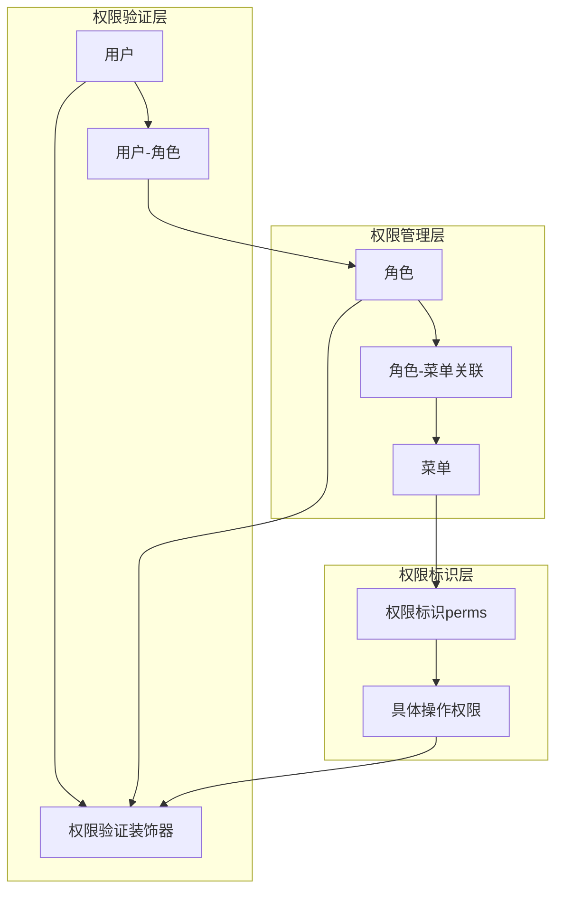
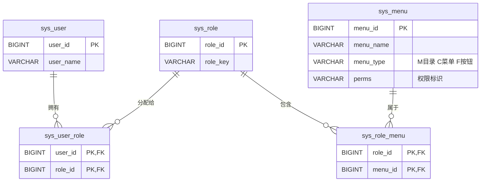
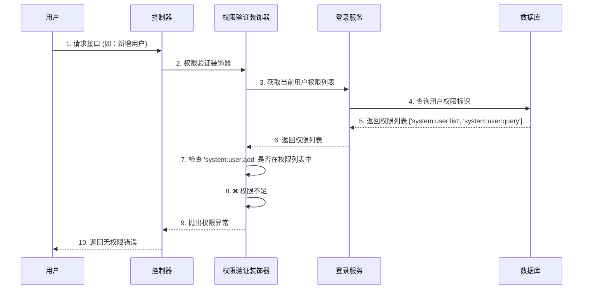
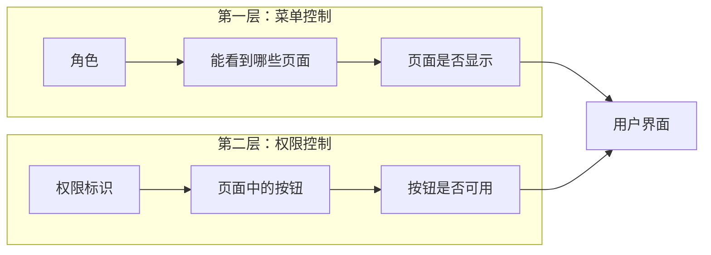

# RuoYi 权限管理系统深度解析

## 🎯 核心问题回答

**问：权限和菜单都是用角色做管理吗？**

**答：不完全是！这是一个双层次的权限管理系统：**
- **菜单访问权限** - 通过角色管理（控制能看什么功能）
- **具体操作权限** - 通过权限标识字符串管理（控制能做什么操作）

---

## 🔐 权限系统的双重架构

### 架构图


---

## 📊 权限管理的两种方式

### 方式1：菜单权限（通过角色管理）

**控制范围：** 用户能看到哪些菜单/功能模块

**实现机制：**
```sql
-- 用户能看到哪些菜单？
SELECT menu_id FROM sys_role_menu
WHERE role_id IN (
    SELECT role_id FROM sys_user_role WHERE user_id = ?
);

-- 示例结果：
-- menu_id: 100 (用户管理菜单)
-- menu_id: 101 (角色管理菜单)
-- menu_id: 103 (部门管理菜单)
```

**实际效果：**
```
✅ 能看到用户管理页面
✅ 能看到角色管理页面
✅ 能看到部门管理页面
❌ 看不到系统监控页面
```

### 方式2：操作权限（通过权限标识管理）

**控制范围：** 用户在具体页面中能执行哪些操作

**实现机制：**
```sql
-- 用户有哪些具体操作权限？
SELECT perms FROM sys_menu
WHERE menu_id IN (
    SELECT menu_id FROM sys_role_menu
    WHERE role_id IN (SELECT role_id FROM sys_user_role WHERE user_id = ?)
);

-- 示例结果：
-- perms: 'system:user:list'     (查看用户列表)
-- perms: 'system:user:query'    (查询用户详情)
-- perms: 'system:user:add'      (新增用户)
-- perms: 'system:user:edit'     (修改用户)
-- perms: 'system:user:remove'   (删除用户)
```

**实际效果：**
```
👁️ 用户列表：✅ 可看 (system:user:list)
🔍 查询按钮：✅ 可点 (system:user:query)
➕ 新增按钮：❌ 灰色 (无system:user:add权限)
✏️ 修改按钮：❌ 灰色 (无system:user:edit权限)
🗑️ 删除按钮：❌ 灰色 (无system:user:remove权限)
```

---

## 🏗️ 权限系统的完整数据流

### 数据库中的权限层级



### 权限数据示例

#### 1. 菜单表中的权限层级
```sql
-- 一级菜单（目录）
INSERT INTO sys_menu VALUES (1, '系统管理', 0, 1, 'system', NULL, NULL, NULL, 1, 0, 'M', '0', '0', NULL, 'system', 'admin', NOW(), '', NULL, '系统管理目录');

-- 二级菜单（页面）
INSERT INTO sys_menu VALUES (100, '用户管理', 1, 1, 'user', 'system/user/index', NULL, NULL, 1, 0, 'C', '0', '0', 'system:user:list', 'user', 'admin', NOW(), '', NULL, '用户管理菜单');

-- 三级菜单（按钮）
INSERT INTO sys_menu VALUES (1000, '用户查询', 100, 1, NULL, NULL, NULL, NULL, 1, 0, 'F', '0', '0', 'system:user:query', '#', 'admin', NOW(), '', NULL, '');
INSERT INTO sys_menu VALUES (1001, '用户新增', 100, 2, NULL, NULL, NULL, NULL, 1, 0, 'F', '0', '0', 'system:user:add', '#', 'admin', NOW(), '', NULL, '');
INSERT INTO sys_menu VALUES (1002, '用户修改', 100, 3, NULL, NULL, NULL, NULL, 1, 0, 'F', '0', '0', 'system:user:edit', '#', 'admin', NOW(), '', NULL, '');
INSERT INTO sys_menu VALUES (1003, '用户删除', 100, 4, NULL, NULL, NULL, NULL, 1, 0, 'F', '0', '0', 'system:user:remove', '#', 'admin', NOW(), '', NULL, '');
```

#### 2. 权限标识的命名规范
```
格式：模块:功能:操作
示例：system:user:add

常见操作类型：
- list  : 列表查看
- query : 详情查询
- add   : 新增操作
- edit  : 修改操作
- remove: 删除操作
- export: 导出操作
- import: 导入操作
```

---

## 🚀 权限验证的实现机制

### 1. 登录时的权限加载

```python
# login_service.py 中的权限获取逻辑
role_id_list = [item.role_id for item in query_user.get('user_role_info')]

if 1 in role_id_list:  # 超级管理员
    permissions = ['*:*:*']  # 超级权限标识
else:
    # 普通用户：获取所有菜单的权限标识
    permissions = [row.perms for row in query_user.get('user_menu_info')]
```

### 2. 接口权限验证装饰器

```python
# interface_auth.py
class CheckUserInterfaceAuth:
    def __call__(self, current_user: CurrentUserModel = Depends(LoginService.get_current_user)):
        user_auth_list = current_user.permissions

        if '*:*:*' in user_auth_list:  # 超级管理员直接通过
            return True

        if self.perm in user_auth_list:  # 检查是否有具体权限
            return True

        raise PermissionException(data='', message='该用户无此接口权限')
```

### 3. 实际使用示例

```python
# user_controller.py 中的权限控制
@userController.get(
    '/list',
    dependencies=[Depends(CheckUserInterfaceAuth('system:user:list'))]
)
async def get_user_list():
    # 用户列表接口 - 需要system:user:list权限
    pass

@userController.post(
    '/',
    dependencies=[Depends(CheckUserInterfaceAuth('system:user:add'))]
)
async def add_user():
    # 新增用户接口 - 需要system:user:add权限
    pass
```

---

## 🎭 权限验证的完整流程

### 用户请求流程图



---

## 💡 权限设计的精髓

### 1. 双重控制机制



### 2. 权限粒度设计

| 级别 | 控制对象 | 实现方式 | 示例 |
|------|----------|----------|------|
| 1级 | 模块/菜单 | 角色-菜单关联 | 能否看到用户管理 |
| 2级 | 页面功能 | 菜单权限标识 | 能否访问用户列表页 |
| 3级 | 具体操作 | 按钮权限标识 | 能否新增、修改、删除 |
| 4级 | 数据范围 | 数据权限规则 | 能看到哪些用户数据 |

### 3. 特殊权限机制

```python
# 超级管理员权限
if '*:*:*' in user_auth_list:
    return True  # 跳过所有权限检查

# 角色权限检查
class CheckRoleInterfaceAuth:
    def __call__(self, current_user: CurrentUserModel):
        user_role_key_list = [role.role_key for role in current_user.user.role]
        if self.role_key in user_role_key_list:
            return True
```

---

## 🎪 实际应用场景

### 场景1：普通员工权限

**角色分配：** 普通角色 (role_id=2)

**菜单权限：** 用户管理 (menu_id=100)

**操作权限：** system:user:list, system:user:query

**实际效果：**
```
✅ 能看到用户管理菜单
✅ 能访问用户列表页面
✅ 能查看用户详情
❌ 新增按钮灰色
❌ 修改按钮灰色
❌ 删除按钮灰色
```

### 场景2：部门主管权限

**角色分配：** 部门主管 (role_id=3)

**菜单权限：** 用户管理、部门管理

**操作权限：** system:user:list, system:user:edit, system:dept:list, system:dept:edit

**实际效果：**
```
✅ 能看到用户管理菜单
✅ 能修改用户信息
✅ 能管理部门信息
❌ 不能删除用户 (无system:user:remove)
❌ 不能新增用户 (无system:user:add)
```

### 场景3：超级管理员权限

**角色分配：** 超级管理员 (role_id=1)

**菜单权限：** 所有菜单

**操作权限：** *:*:* (超级权限)

**实际效果：**
```
✅ 所有功能全部可用
✅ 所有数据全部可见
✅ 所有操作全部执行
```

---

## 🔍 权限验证的SQL示例

### 检查用户是否有菜单访问权限
```sql
-- 检查用户(user_id=3)是否有用户管理菜单权限
SELECT COUNT(*) as has_menu_permission
FROM sys_user_role ur
JOIN sys_role_menu rm ON ur.role_id = rm.role_id
WHERE ur.user_id = 3 AND rm.menu_id = 100;
```

### 检查用户是否有具体操作权限
```sql
-- 检查用户(user_id=3)是否有新增用户权限
SELECT COUNT(*) as has_operation_permission
FROM sys_user_role ur
JOIN sys_role_menu rm ON ur.role_id = rm.role_id
JOIN sys_menu m ON rm.menu_id = m.menu_id
WHERE ur.user_id = 3 AND m.perms = 'system:user:add';
```

### 获取用户所有权限标识
```sql
-- 获取用户(user_id=3)的所有权限标识
SELECT DISTINCT m.perms
FROM sys_user_role ur
JOIN sys_role_menu rm ON ur.role_id = rm.role_id
JOIN sys_menu m ON rm.menu_id = m.menu_id
WHERE ur.user_id = 3 AND m.perms IS NOT NULL;
```

---

## 🎯 总结

**权限和菜单的管理方式：**

1. **菜单权限**：通过 **角色-菜单关联表** (`sys_role_menu`) 管理
   - 控制用户能看到哪些功能模块
   - 是粗粒度的访问控制

2. **操作权限**：通过 **权限标识字符串** (`sys_menu.perms`) 管理
   - 控制用户能执行哪些具体操作
   - 是细粒度的功能控制

3. **数据权限**：通过 **角色-部门关联** (`sys_role_dept`) + **数据权限范围** (`role.data_scope`) 管理
   - 控制用户能访问哪些数据范围

**设计优势：**
- 🔐 **安全性高**：多层权限验证
- 🎯 **粒度精细**：可以控制到按钮级别
- 🔄 **灵活配置**：权限可灵活组合
- 📈 **扩展性强**：容易添加新的权限类型

这种双重权限管理机制，既保证了系统的安全性，又提供了足够的灵活性来应对各种复杂的业务场景！ 🚀