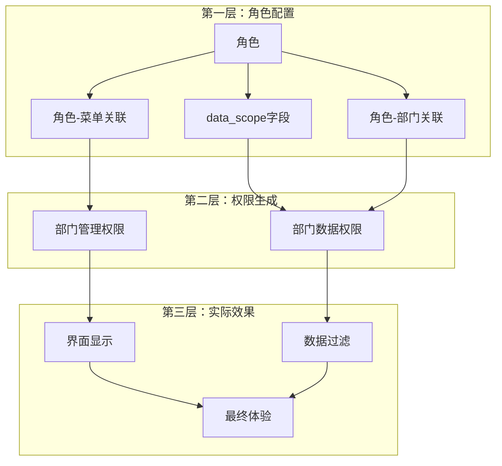

# 部门权限来源解析

## 🎯 核心问题回答

**你的理解基本正确！部门的"数据权限"确实来自角色，但需要区分两种概念：**

1. **部门的访问权限** - 来自角色（通过角色-菜单关联）
2. **部门的数据权限** - 来自角色的data_scope配置

---

## 🔐 部门权限的双重来源

### 来源1：部门访问权限（通过角色控制）

**控制内容：** 用户能否访问部门管理功能

**数据来源：** 角色 → 菜单关联表

```sql
-- 检查用户是否有部门管理权限
SELECT COUNT(*) as has_dept_permission
FROM sys_user_role ur
JOIN sys_role_menu rm ON ur.role_id = rm.role_id
WHERE ur.user_id = ? AND rm.menu_id = 103; -- 103是部门管理菜单ID

-- 示例：
-- 张三(研发主管): role_id=3, 有menu_id=103权限 ✅
-- 李四(测试主管): role_id=4, 有menu_id=103权限 ✅
-- 普通员工: role_id=2, 有menu_id=103权限 ✅
```

### 来源2：部门数据权限（通过角色data_scope控制）

**控制内容：** 用户能管理部门的数据范围

**数据来源：** 角色的data_scope字段 + 角色-部门关联表

```sql
-- 角色表中的数据权限配置
role_id  role_name    data_scope  说明
1        超级管理员   1           全部数据权限
2        普通角色     2           自定义数据权限
3        研发主管     2           自定义数据权限
4        测试主管     3           本部门数据权限

-- 角色-部门关联表（sys_role_dept）
role_id  dept_id  说明
2        100      普通角色可管理部门100
2        101      普通角色可管理部门101
2        105      普通角色可管理部门105
```

---

## 🏗️ 部门权限的完整架构



---

## 📊 具体示例分析

### 角色配置表

| role_id | role_name | data_scope | 角色说明 |
|---------|-----------|------------|----------|
| 1 | 超级管理员 | 1 | 全部数据权限 |
| 2 | 普通角色 | 2 | 自定义数据权限 |
| 3 | 研发主管 | 2 | 自定义数据权限 |
| 4 | 测试主管 | 3 | 本部门数据权限 |

### 角色-菜单关联（sys_role_menu）

```sql
-- 所有角色都有部门管理权限
role_id  menu_id  menu_name
1        103      部门管理
2        103      部门管理
3        103      部门管理
4        103      部门管理
```

### 角色-部门关联（sys_role_dept）

```sql
-- 自定义权限角色的部门配置
role_id  dept_id  dept_name
2        100      集团总公司
2        101      深圳分公司
2        105      测试部门
3        103      研发部门（假设配置）
3        105      测试部门（假设配置）
```

---

## 🎭 实际权限效果

### 超级管理员 (role_id=1, data_scope=1)
```
✅ 部门管理权限：有（通过role_id=1 → menu_id=103）
✅ 部门数据权限：全部（data_scope=1，跳过部门过滤）
🎯 实际效果：可以管理所有部门的部门信息
```

### 普通角色 (role_id=2, data_scope=2)
```
✅ 部门管理权限：有（通过role_id=2 → menu_id=103）
✅ 部门数据权限：自定义（data_scope=2 + sys_role_dept配置）
🎯 实际效果：只能管理指定的部门（100,101,105）
```

### 研发主管 (role_id=3, data_scope=2)
```
✅ 部门管理权限：有（通过role_id=3 → menu_id=103）
✅ 部门数据权限：自定义（data_scope=2 + 假设配置103,105）
🎯 实际效果：只能管理研发和测试部门
```

### 测试主管 (role_id=4, data_scope=3)
```
✅ 部门管理权限：有（通过role_id=4 → menu_id=103）
✅ 部门数据权限：本部门（data_scope=3 + 用户所在部门105）
🎯 实际效果：只能管理测试部门
```

---

## 🔍 技术实现细节

### 1. 部门管理权限检查

```python
# controller/role_controller.py
@roleController.get('/deptTree/{role_id}',
                   dependencies=[Depends(CheckUserInterfaceAuth('system:role:query'))])
async def get_system_role_dept_tree(...):
    # 权限检查：检查是否有system:role:query权限
    # 这个权限来自角色的菜单配置，与部门无关
```

### 2. 部门数据权限过滤

```python
# aspect/data_scope.py
class GetDataScope:
    def __call__(self, current_user: CurrentUserModel):
        for role in current_user.user.role:
            if role.data_scope == self.DATA_SCOPE_CUSTOM:
                # 自定义数据权限：查询sys_role_dept表
                param_sql_list.append(
                    f"dept_id IN (SELECT dept_id FROM sys_role_dept WHERE role_id = {role.role_id})"
                )
            elif role.data_scope == self.DATA_SCOPE_DEPT:
                # 本部门数据权限：使用用户所在部门
                param_sql_list.append(f"dept_id = {current_user.user.dept_id}")
```

### 3. 实际使用

```python
# controller/dept_controller.py
@deptController.get('/list', dependencies=[Depends(CheckUserInterfaceAuth('system:dept:list'))])
async def get_system_dept_list(
    request: Request,
    query_db: AsyncSession = Depends(get_db),
    data_scope_sql: str = Depends(GetDataScope('SysDept'))  # 注入数据权限SQL
):
    # 第一层权限检查：system:dept:list（来自角色菜单配置）
    # 第二层数据过滤：data_scope_sql（来自角色data_scope配置）
    dept_query_result = await DeptService.get_dept_list_services(
        query_db, DeptModel(**{}), data_scope_sql
    )
```

---

## 💡 关键发现

### 部门权限的"双重来源"

1. **访问权限来源：** 角色菜单关联 (`sys_role_menu`)
   - 决定用户能否看到部门管理页面
   - 与用户所在部门无关

2. **数据权限来源：** 角色数据权限配置 (`role.data_scope` + `sys_role_dept`)
   - 决定用户能管理部门的数据范围
   - 与角色配置和用户部门都相关

### 权限验证的SQL逻辑

```sql
-- 检查部门访问权限（第一层）
SELECT COUNT(*) FROM sys_user_role ur
JOIN sys_role_menu rm ON ur.role_id = rm.role_id
WHERE ur.user_id = ? AND rm.menu_id = 103;

-- 生成数据权限SQL（第二层）
-- 根据角色data_scope生成不同的WHERE条件
CASE
  WHEN data_scope = 1 THEN '1 = 1'                    -- 全部数据
  WHEN data_scope = 2 THEN 'dept_id IN (100,101,105)' -- 自定义权限
  WHEN data_scope = 3 THEN 'dept_id = 105'            -- 本部门
  WHEN data_scope = 4 THEN 'dept_id IN (103,105,106)' -- 本部门及下属
END
```

---

## 🎯 总结

### 部门权限的真实来源：

**✅ 访问权限 = 角色菜单关联**
- 所有通过角色分配部门管理菜单权限的用户都能访问部门功能
- 这与用户的实际部门无关

**✅ 数据权限 = 角色数据配置**
- 通过角色的data_scope字段决定数据范围
- 自定义权限通过sys_role_dept表进一步限定部门

### 权限配置流程：

1. **创建角色** → 配置role的data_scope字段
2. **分配菜单** → 在sys_role_menu中添加部门管理菜单
3. **配置数据权限** → 在sys_role_dept中关联可管理部门
4. **分配角色** → 用户获得角色的所有权限配置

### 设计优势：

- **🔐 灵活性：** 同一个功能可以配置不同的数据权限
- **🎯 精确性：** 访问权限和数据权限分离控制
- **📈 扩展性：** 支持复杂的数据权限规则

所以你的理解是对的：**部门的权限确实来自于角色，但需要区分是访问权限还是数据权限！** 🚀